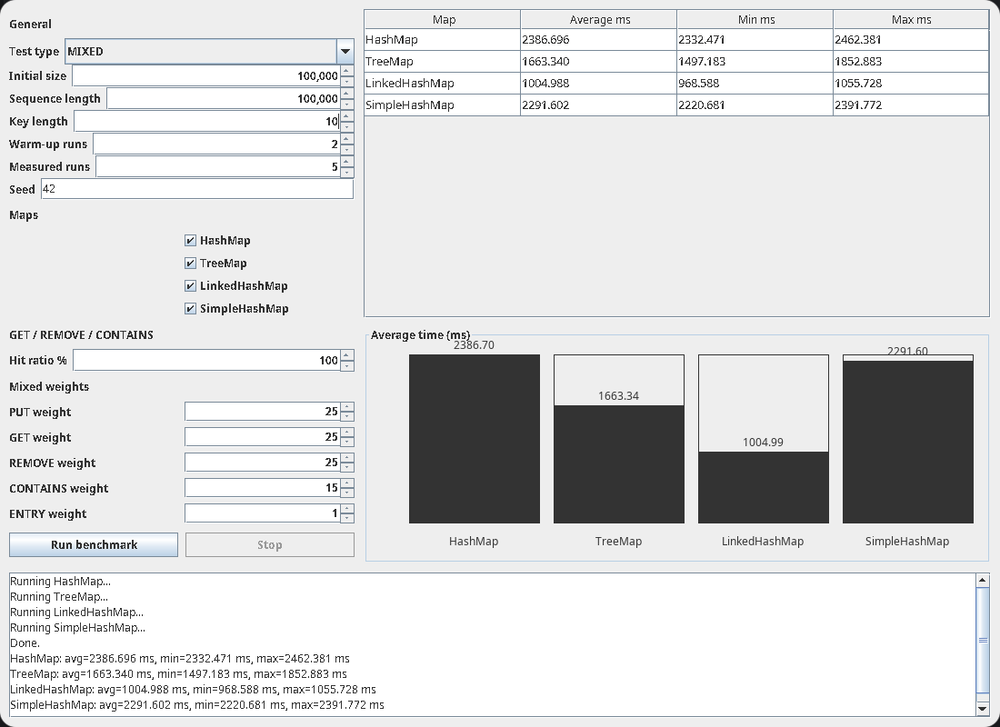
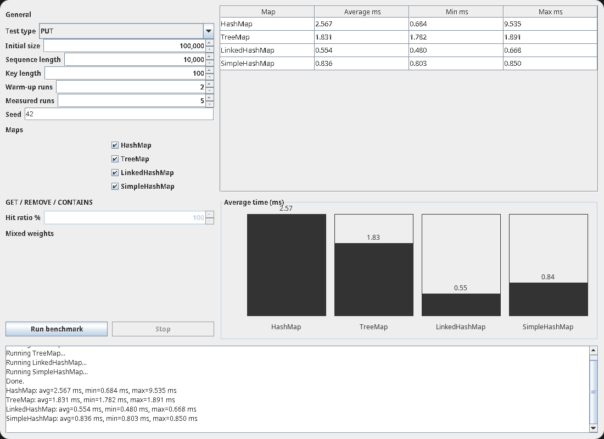

# Задача
22. Реализовать приложение, которое осуществляет сравнение производительности
    различных вариантов Map<K, V> (как минимум, TreeMap<> и HashMap<>) для
    различных вариантов использования – только вставка случайных элементов, только
    поиск случайных элементов, только удаление случайных элементов, комбинация вставки
    и удаления случайных элементов. В качестве ключей использовать строки
    фиксированной длины (задается пользователем). Построить графики зависимости
    времени работы от количества вставляемых / запрашиваемых / удаляемых элементов.
    (При тестировании надо вначале генерировать последовательность действий (ключей),
    которые необходимо выполнить, а уже потом, по готовой последовательности ключей,
    измерять производительность последовательности операций, чтобы учитывать только
    время работы со словарем.)

# Использованные типы Map
- HashMap
- TreeMap
- LinkedHashMap
- SimpleHashMap (Самописная структура)

# Практическое применение
Также может быть полезно, чтобы рассказать какие Map для каких задач лучше всего использовать, ведь в программе наглядно видно сколько времени уходит для каждого типа чтобы обработать словарь

# GUI

